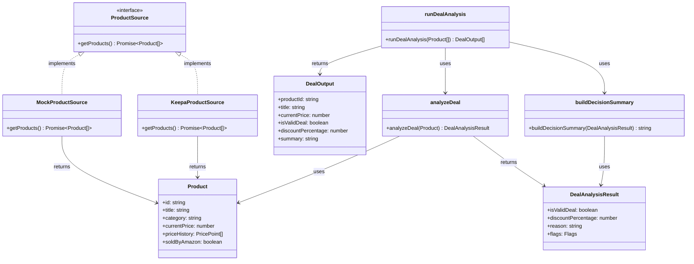
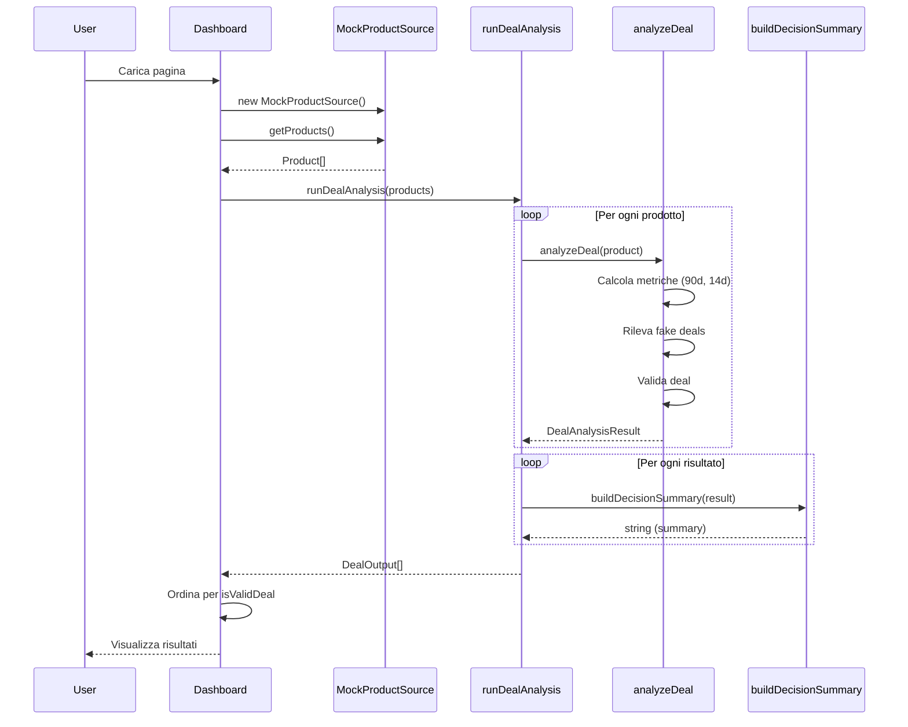

# Architettura del Sistema - Diagramma

## Diagramma Architetturale


## Confini Architetturali

### 1. **Models Layer** (Foundation)
- **Nessuna dipendenza**: Solo type definitions TypeScript
- **Usato da**: Tutti i layer (Core, Adapters, Dashboard)
- **Confine**: Contratti immutabili condivisi

### 2. **Core Layer** (Business Logic)
- **Dipende solo da**: Models
- **Nessuna dipendenza da**: Adapters, Dashboard, Framework
- **Confine**: Logica pura, testabile in isolamento
- **Espone**: Funzioni pubbliche (`analyzeDeal`, `runDealAnalysis`)

### 3. **Adapter Layer** (Data Access)
- **Dipende solo da**: Models (ProductSource interface)
- **Nessuna dipendenza da**: Core, Dashboard
- **Confine**: Pattern Strategy, intercambiabile
- **Implementa**: `ProductSource.getProducts(): Promise<Product[]>`

### 4. **Consumer Layer** (UI/CLI)
- **Dipende da**: Core, Adapters, Models
- **Confine**: Solo visualizzazione/orchestrazione
- **Nessuna logica di business**: Delega tutto al Core

### 5. **Data Layer** (Static Data)
- **Nessuna dipendenza**: File JSON
- **Usato da**: MockProductSource
- **Confine**: Solo sviluppo/demo

## Regole di Dipendenza

```
Models ← Core ← Consumers
Models ← Adapters ← Consumers
Data ← Adapters
```

**Principio**: Le dipendenze vanno sempre verso il basso (verso Models), mai verso l'alto o orizzontali tra layer dello stesso livello.

## Flusso di Dati

1. **Consumer** istanzia un **Adapter** (es. MockProductSource)
2. **Adapter** restituisce `Product[]` (da Models)
3. **Consumer** chiama `runDealAnalysis(products)` dal **Core**
4. **Core** applica `analyzeDeal()` a ogni prodotto
5. **Core** formatta con `buildDecisionSummary()`
6. **Core** restituisce `DealOutput[]` al **Consumer**
7. **Consumer** visualizza i risultati

## Diagramma delle Interfacce e Contratti



## Diagramma di Sequenza (Flusso Esecutivo)



## Violazioni dei Confini (Da Evitare)

❌ Core → Adapters (Core non deve conoscere implementazioni specifiche)
❌ Core → Dashboard (Core non deve dipendere da UI)
❌ Adapters → Core (Adapters non devono contenere logica di business)
❌ Models → Altri layer (Models sono solo tipi, nessuna logica)

