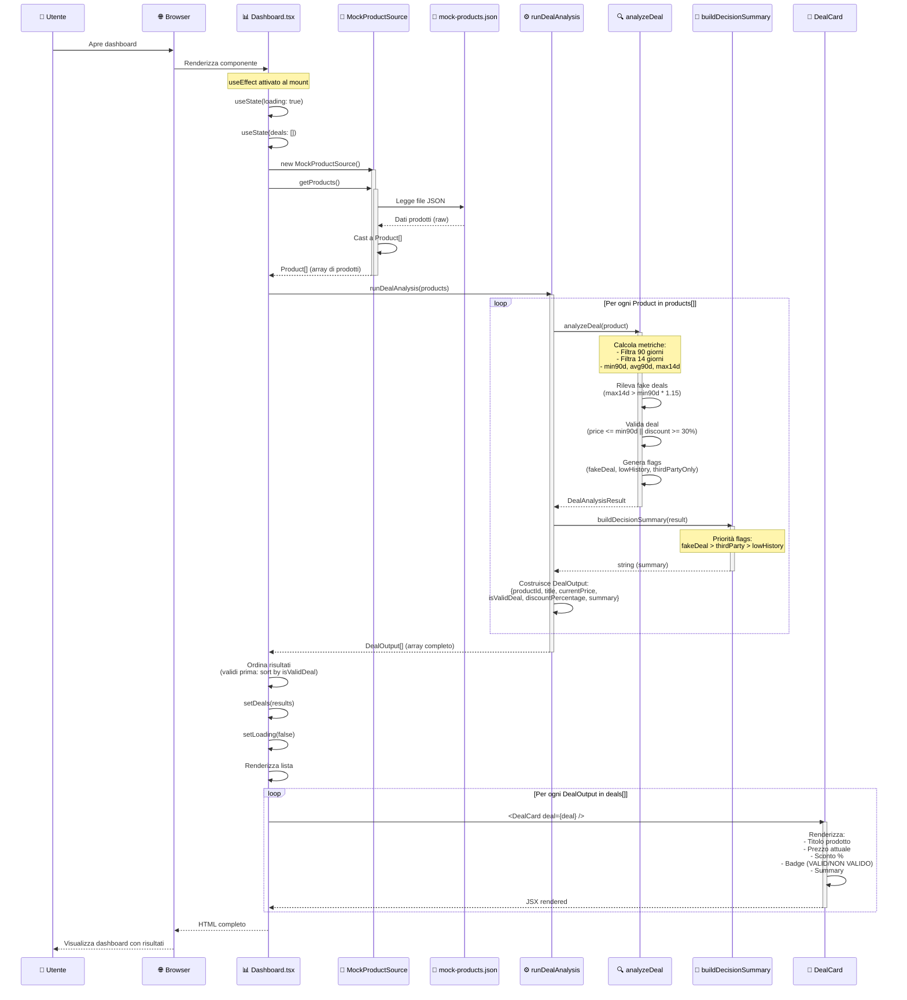
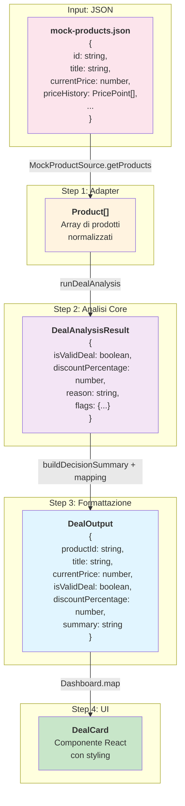
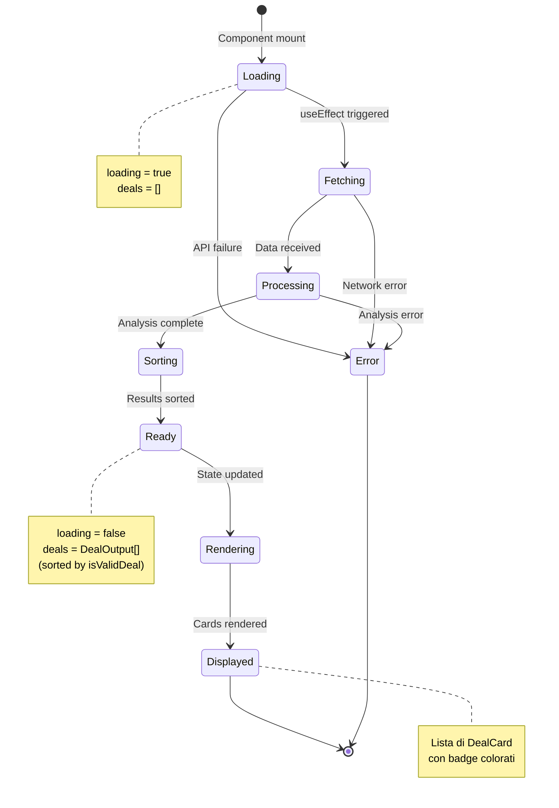

# Flusso della Dashboard - Dalla Chiamata Dati all'Output Finale

## Diagramma di Sequenza Completo



## Diagramma di Flusso (Flowchart)

```mermaid
flowchart TD
    Start([👤 Utente apre dashboard]) --> Mount[📊 Dashboard monta]
    
    Mount --> InitState[Inizializza state:<br/>loading = true<br/>deals = []]
    
    InitState --> UseEffect[useEffect attivato]
    
    UseEffect --> CreateAdapter[🔌 Crea MockProductSource]
    
    CreateAdapter --> CallAPI[Chiama getProducts]
    
    CallAPI --> ReadJSON[📄 Legge mock-products.json]
    
    ReadJSON --> ParseData[Parsa JSON → Product[]]
    
    ParseData --> CallAnalysis[⚙️ Chiama runDealAnalysis products]
    
    CallAnalysis --> LoopStart{Per ogni<br/>Product}
    
    LoopStart --> Analyze[🔍 analyzeDeal product]
    
    Analyze --> CalcMetrics[Calcola metriche:<br/>• Filtra 90 giorni<br/>• Filtra 14 giorni<br/>• min90d, avg90d, max14d]
    
    CalcMetrics --> DetectFake[Rileva fake deals:<br/>max14d > min90d * 1.15<br/>&& currentPrice ~ min90d]
    
    DetectFake --> ValidateDeal[Valida deal:<br/>price <= min90d<br/>|| discount >= 30%]
    
    ValidateDeal --> GenerateFlags[Genera flags:<br/>fakeDeal, lowHistory,<br/>thirdPartyOnly]
    
    GenerateFlags --> BuildResult[Costruisce DealAnalysisResult]
    
    BuildResult --> BuildSummary[📝 buildDecisionSummary]
    
    BuildSummary --> PriorityCheck{Controlla<br/>priorità flags}
    
    PriorityCheck -->|fakeDeal| FakeMsg[Summary: Fake deal]
    PriorityCheck -->|thirdPartyOnly| ThirdMsg[Summary: Terze parti]
    PriorityCheck -->|lowHistory| LowMsg[Summary: Storico breve]
    PriorityCheck -->|isValidDeal| ValidMsg[Summary: Affare valido]
    PriorityCheck -->|default| NoDealMsg[Summary: Nessun affare]
    
    FakeMsg --> CreateOutput
    ThirdMsg --> CreateOutput
    LowMsg --> CreateOutput
    ValidMsg --> CreateOutput
    NoDealMsg --> CreateOutput
    
    CreateOutput[Costruisce DealOutput:<br/>productId, title, price,<br/>isValidDeal, discount, summary]
    
    CreateOutput --> LoopCheck{Altri<br/>prodotti?}
    
    LoopCheck -->|Sì| LoopStart
    LoopCheck -->|No| SortResults[Ordina risultati:<br/>validi prima]
    
    SortResults --> UpdateState[Aggiorna state:<br/>setDeals results<br/>setLoading false]
    
    UpdateState --> RenderCheck{loading?}
    
    RenderCheck -->|true| LoadingUI[Mostra: Caricamento...]
    RenderCheck -->|false| RenderList[Renderizza lista deals]
    
    RenderList --> MapDeals{Per ogni<br/>DealOutput}
    
    MapDeals --> RenderCard[🎴 Renderizza DealCard]
    
    RenderCard --> CardContent[Mostra:<br/>• Titolo<br/>• Prezzo €<br/>• Sconto %<br/>• Badge colorato<br/>• Summary]
    
    CardContent --> CardCheck{Altri<br/>deals?}
    
    CardCheck -->|Sì| MapDeals
    CardCheck -->|No| End([✅ Dashboard completa])
    
    LoadingUI --> End
    
    style Start fill:#e1f5ff
    style End fill:#c8e6c9
    style Analyze fill:#fff3e0
    style BuildSummary fill:#f3e5f5
    style RenderCard fill:#e8f5e9
```

## Flusso Dati Dettagliato

```mermaid
flowchart LR
    subgraph "Fase 1: Caricamento Dati"
        A1[JSON File] -->|read| A2[MockProductSource]
        A2 -->|getProducts| A3[Product[]]
    end
    
    subgraph "Fase 2: Analisi"
        A3 -->|input| B1[runDealAnalysis]
        B1 -->|per ogni| B2[analyzeDeal]
        B2 -->|calcola| B3[Metriche:<br/>min90d, avg90d, max14d]
        B3 -->|genera| B4[DealAnalysisResult]
        B4 -->|input| B5[buildDecisionSummary]
        B5 -->|output| B6[Summary string]
        B6 -->|combina| B7[DealOutput]
    end
    
    subgraph "Fase 3: Presentazione"
        B7 -->|array| C1[DealOutput[]]
        C1 -->|ordina| C2[Sorted by isValidDeal]
        C2 -->|state| C3[Dashboard state]
        C3 -->|render| C4[DealCard components]
        C4 -->|visualizza| C5[UI Finale]
    end
    
    A1 -.->|"1. Lettura"| A2
    A2 -.->|"2. Parsing"| A3
    A3 -.->|"3. Analisi"| B1
    B1 -.->|"4. Processing"| B7
    B7 -.->|"5. Output"| C1
    C1 -.->|"6. Display"| C5
    
    style A1 fill:#fce4ec
    style B2 fill:#fff3e0
    style B5 fill:#f3e5f5
    style C4 fill:#e8f5e9
    style C5 fill:#c8e6c9
```

## Trasformazione dei Dati



## Stati della Dashboard



## Componenti e Responsabilità

| Componente | Input | Output | Responsabilità |
|------------|-------|--------|----------------|
| **Dashboard.tsx** | - | JSX | Orchestrazione, state management, rendering lista |
| **MockProductSource** | - | `Product[]` | Lettura e parsing dati JSON |
| **runDealAnalysis** | `Product[]` | `DealOutput[]` | Batch processing, mapping risultati |
| **analyzeDeal** | `Product` | `DealAnalysisResult` | Algoritmo analisi, calcolo metriche |
| **buildDecisionSummary** | `DealAnalysisResult` | `string` | Formattazione messaggio utente |
| **DealCard** | `DealOutput` | JSX | Visualizzazione singolo deal |

## Note sul Flusso

1. **Caricamento asincrono**: `useEffect` gestisce il caricamento dati senza bloccare il rendering iniziale
2. **State management**: Due stati (`loading`, `deals`) per gestire UI loading e risultati
3. **Ordinamento**: I deal validi vengono mostrati per primi per UX migliore
4. **Componentizzazione**: `DealCard` separato per riusabilità e testabilità
5. **Trasformazione dati**: Ogni step trasforma i dati in formato più adatto al layer successivo

