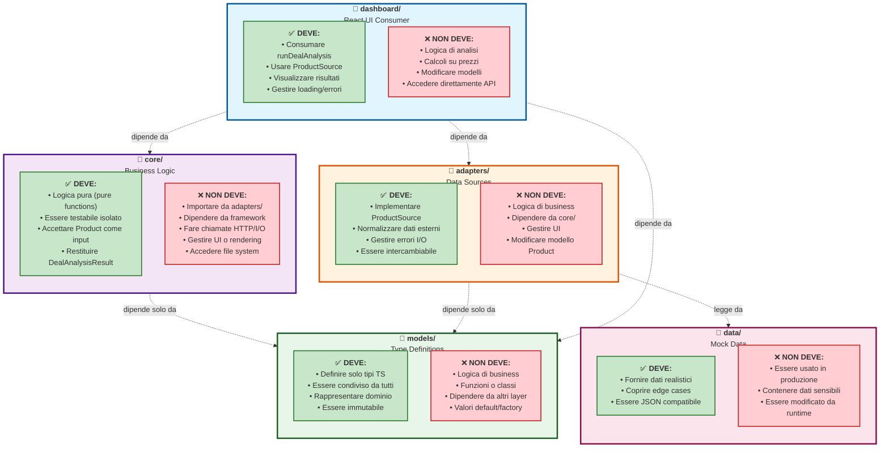
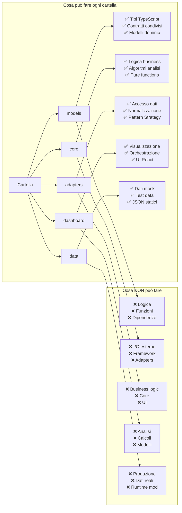
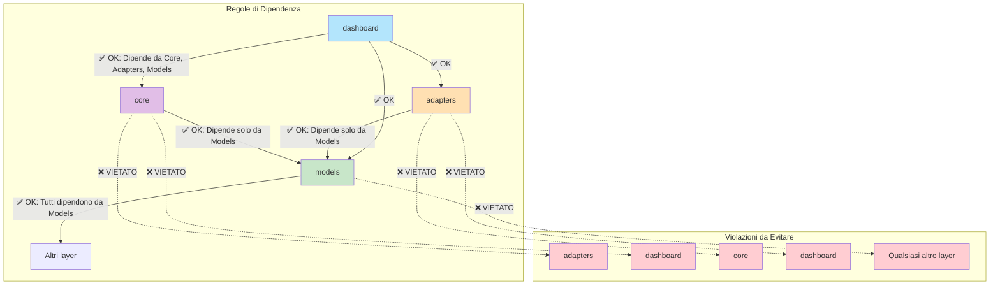

# Responsabilità e Limiti delle Cartelle

## Diagramma delle Responsabilità

## Matrice delle Responsabilità

## Confini e Violazioni

## Tabella Riassuntiva

| Cartella | Responsabilità Principale | Dipende da | Usato da | Limiti Critici |
|----------|---------------------------|------------|----------|----------------|
| **models/** | Definire tipi TypeScript | Nessuna | Tutti | ❌ Nessuna logica |
| **core/** | Logica di business | models | dashboard, CLI | ❌ No I/O, no framework |
| **adapters/** | Accesso dati | models | dashboard, CLI | ❌ No business logic |
| **dashboard/** | UI React | core, adapters, models | Utenti | ❌ No analisi, solo visualizzazione |
| **data/** | Dati mock | Nessuna | adapters | ❌ Solo sviluppo, no produzione |

## Principi Architetturali

1. **Separazione delle Responsabilità**: Ogni cartella ha un unico scopo chiaro
2. **Dipendenze Unidirezionali**: Sempre verso il basso (verso models)
3. **Indipendenza del Core**: Il core non conosce implementazioni specifiche
4. **Intercambiabilità**: Gli adapter possono essere sostituiti senza modificare il core
5. **Testabilità**: Ogni layer può essere testato in isolamento

